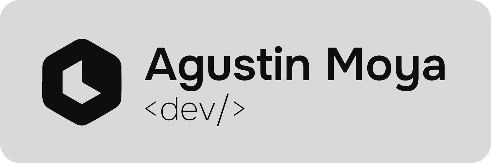

  

<h1 align="center">Hi there, I'm Agustín 👋</h1>
<h3 align="center">Frontend Developer 💻 + UX/UI Designer 🎨</h3>

  Specialized in building dynamic, scalable, and visually polished web experiences. 
  I blend <b>React & TypeScript</b> logic with strong design principles to create products that work as beautifully as they look.

 

<h3 align="left">🛠️ Tech Stack</h3>

  

 

<h3 align="left">📫 Let's Connect</h3>

  
    
  

 
